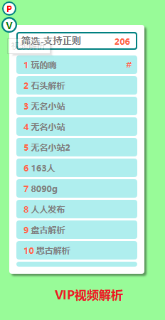
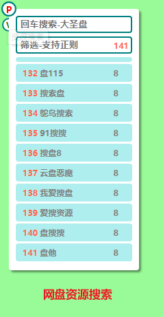
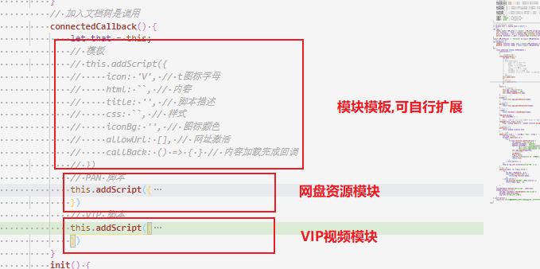
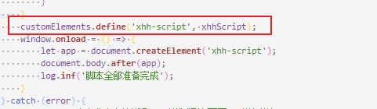
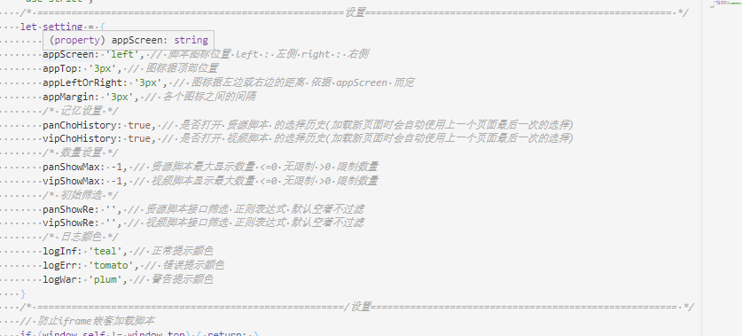
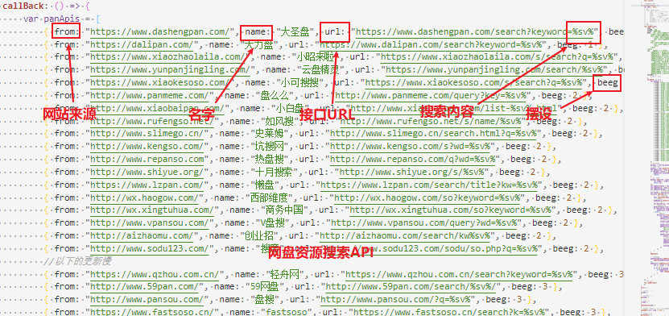
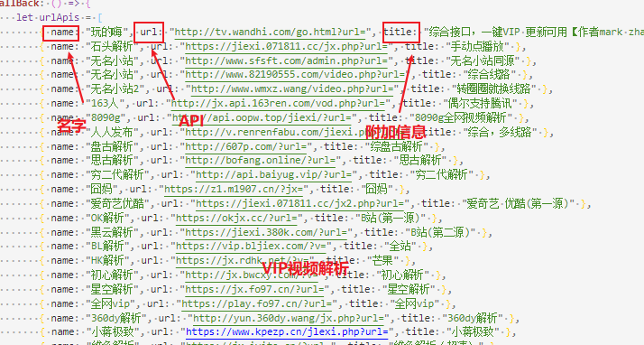

# Xhh-Script
**自用油猴脚本-VIP视频解析-网盘资源搜索**

## 感谢

**感谢各位 API 的制作者,有了你们我才能快乐的玩耍♪(＾∀＾●)ﾉ.**

## 功能

+ **VIP视频解析(覆盖大部分视频网站)**
+ **网盘资源搜索**

## 界面截图及使用方法

**绿色背景请忽视 ⊙﹏⊙,只是拿来演示截图用的,实际没有的**

**vip视频解析使用方法:**

+ 进入想要观看视频的网页
+ 点击脚本上的解析接口的列表项即可
+ 可以筛选符合要求的接口

**注**: 旁边的 `#` 表示上一次点击的是哪一个接口

**网盘资源搜索使用方法:**

+ 点击接口列表
+ 再向最顶部的文本框输入要搜索资源的名字,回车即可开始搜索.

## 说明

+ 脚本中的API接口均来自于网络搜索,以及油猴的的前辈们.
+ 脚本可以用于 **油猴** 或 **`<script>`引入网页** 但是用 **引入** 的话会有部分功能无法实现.
+ 兼容性未作处理,无法使用的话我也没辙,反正我自己可以用♪(＾∀＾●)ﾉ(**注**: 本人使用QQ浏览器,加红色油猴).

## 脚本特点

+ **可自行扩展**

+ **脚本采用 Shadow DOM**

+ **脚本会记住你上一次的选择**

+ **兼容性差,也算是吧 ⊙﹏⊙‖**

## 设置

+ **修改设置**

+ **网盘资源搜索API 可自行扩展,API越前,显示也就越靠前**

+ **VIP视频解析API 同上一个也可以自行扩展**

## 其它

其实这个脚本是学习到 Shadow DOM 是写的,在这之前还有一版,权当练手小项目.

学习网址 [JAVASCRIPT.INFO](https://zh.javascript.info/)

